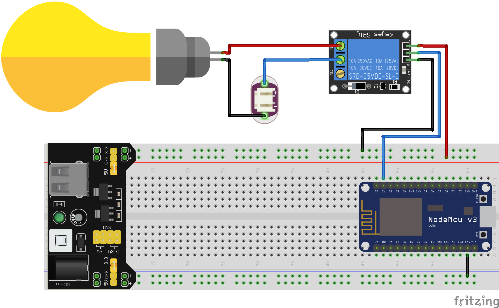

# iot-node-johnny-five

The purpose of this project is to create a pure NodeJS solution to IoT projects. With [Johnny-Five](http://johnny-five.io), [Express JS](http://expressjs.com) and [NodeMCU](http://nodemcu.com/index_en.html) will be able to create nice 'IoT things' over wifi with minimal effort on NodeMCU firmware.

This implementation are able to turn on and turn off a Lamp using a relay over wifi and blink a led with only NodeJS code as example. Go haead and code own "things" =).

# Solution

To make the things really simple, the project use johnny-five board integrates with expressjs routes using node event emitter, so once the server is running the express routes could access johnny-five components created on the folder 'server/components' using johnny-five components. The firmware placed on the folder 'device' is a PlatformIO project, a nodejs script configure the wifi properties and make uses of Platform IO CLI to compile and deploy the firmware to NodeMUC over USB. After compiled and deployed, run the server and that's it! You could keep the firwmare running and change our code without recompile and redeploy the firmware code! You could attach more hardware components without much effort and just code johnny-five component on 'server/components', take a look at this folder.

# Architecture of the solution
The solution is composeded by one NodeMCU to run the firwmare code, one Relay, one Lamp and one power supply to feed NodeMUC and Relay.

And of course one NodeJS process running the express server with johnny-five code.

This is a basic sketch that represents the hardware's solution.



# Setup

This project use [Platformio Core](https://docs.platformio.org/en/latest/core.html) to compile and do the upload of native files for [NodeMCU](http://nodemcu.com/index_en.html)

 - First you need to install *[PlatformIO Core](https://docs.platformio.org/en/latest/installation.html)*;
 - Run ``` npm install``` to install **Node** dependencies and configure **PlatformIO** project;
 - Configure/Creates a .env file with Wifi credentials:

    To configure wifi on device:

    ```
    DEVICE_WIFI_SSID=YOUR_WIFI_SSID
    DEVICE_WIFI_PASSWORD=YOUR_WIFI_PASSWORD        
    ```

    Set the server port of device firmata (default is 3030):
    ```
    DEVICE_SERVER_PORT=3030
    ```

    -   You could configure ip adress for device by two ways:
    
        1ª Using static ip address:
        ```
        DEVICE_STATIC_IP_ADDRESS=10,101,42,5
        DEVICE_SUBNET_MASK=255,255,255,0
        DEVICE_GATEWAY_IP_ADDRESS=0,0,0,12
        ```
    
        \* These one uses **comma** to separete the numbers.

        2ª Uploading the source code and coping IP from serial monitor and setting (Check **Upload Standard Firmata Wifi to Device**):
        ```
        DEVICE_IP_ADDRESS=IP_FROM_SERIAL_MONITOR
        ```
        \* This one uses **point** to separete the numbers.

# Execution

## Upload Standard Firmata Wifi to Device

Run ```npm run upload``` to configure device wifi settings with .env infos, compile the native code and do the upload to connected **NodeMCU**. After executes the upload, serial monitor will be shown.

This command will upload to default usb port, if you need to specify the usb port, see [upload.sh](scripts/pio/upload.sh)

## Start Express server

Running ```npm start```  will start **Johnny-Five** board and **Express** server leaving available two options to change the relay behavior.

1ª By [Node REPL](https://nodejs.org/api/repl.html) accessing Johnny-Five Relay options on command line:
```
relay.on();

or

relay.off();
```

2ª By making a get request to **Express** route ```/lamp/:status``` where status could be **on** or **off**

```sh
curl http://locahost:3000/lamp/on

or

curl http://locahost:3000/lamp/off
```

# Results

This project show how to create a IoT solution with almost zero knowledgment on **Arduino** and **NodeMCU**, for example, making it easy to create IoT project with  pure **NodeJS** skills.


### TODO
    - Configure a JSON to create a custom number of devices where each device has it owns network settings

### References:
    - http://johnny-five.io
    - https://make.kosakalab.com/make/electronic-work/js_robotics_wifi/
    - http://wifinodebot.blogspot.com/2016/02/blink-led-over-wifi-with-nodejs-johnny.html
    - https://www.instructables.com/id/ESP8266-Firmata-J5-NodeBot/
    - https://diyprojects.io/connecting-esp8266-blynk-johnny-five-firmata-wifi/#.W6g7PXVKg-Z
    - https://docs.platformio.org/en/latest/core.html
